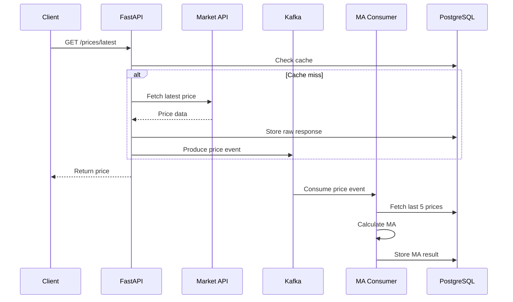

# market-data-service

# Market Data Service Documentation

## Overview

The Market Data Service is a production-ready microservice designed to fetch market data, process it through a streaming pipeline, and serve it via REST APIs. It integrates with external market data providers, processes raw data into meaningful insights (e.g., moving averages), and provides real-time updates via Kafka. The service is built with FastAPI, PostgreSQL, and Apache Kafka, ensuring scalability, reliability, and modularity.

---

## Features

1. **Market Data Fetching**:
   - Fetches real-time price data for specified symbols from external providers (e.g., Yahoo Finance).
   - Supports configurable polling intervals.

2. **Streaming Pipeline**:
   - Publishes raw price data to Kafka (`price-events` topic).
   - Computes 5-point moving averages and stores results in the `symbol_averages` table.

3. **REST API**:
   - Provides endpoints for fetching the latest price and scheduling polling jobs.
   - OpenAPI documentation for easy integration.

4. **Database Integration**:
   - Stores raw market data, processed price points, polling job configurations, and moving averages.
   - Optimized with indexes on `timestamp` and `symbol`.

5. **Dockerized Deployment**:
   - Fully containerized with Docker Compose for local development and production environments.
   - Includes PostgreSQL, Kafka, and FastAPI services.

---

## Architecture


### Data Flow Diagram


---

## API Documentation

### Endpoints

#### **GET /prices/latest**
Fetch the latest price for a given symbol.

**Query Parameters**:
- `symbol` (required): The stock symbol (e.g., `AAPL`).
- `provider` (optional): The data provider (default: Yahoo Finance).

**Response**:
```json
{
  "symbol": "AAPL",
  "price": 150.25,
  "timestamp": "2024-03-20T10:30:00Z",
  "provider": "yahoo_finance"
}
```

---

#### **POST /prices/poll**
Schedule a polling job for specified symbols.

**Request Body**:
```json
{
  "symbols": ["AAPL", "MSFT"],
  "interval": 60,
  "provider": "yahoo_finance"
}
```

**Response**:
```json
{
  "job_id": "poll_123",
  "status": "accepted",
  "config": {
    "symbols": ["AAPL", "MSFT"],
    "interval": 60
  }
}
```

---

## Database Schema

### Tables

1. **polling_job**:
   - Stores configurations for polling jobs.
   - Columns: `id`, `symbols`, `interval`, `provider`, `created_at`, `status`.

2. **price_point**:
   - Stores raw price data fetched from external providers.
   - Columns: `id`, `symbol`, `timestamp`, `price`, `provider`, `raw_response_id`.

3. **symbol_averages**:
   - Stores computed moving averages for symbols.
   - Columns: `id`, `symbol`, `timestamp`, `average_price`.

4. **raw_market_data**:
   - Stores raw responses from external market data providers.
   - Columns: `id`, `symbol`, `timestamp`, `source`, `data`.


---

## Setup Instructions

### Prerequisites
- Docker and Docker Compose installed.
- Python 3.10+ installed locally (optional for development).

### Steps

1. Clone the repository:
   ```bash
   git clone https://github.com/an-siuu-man/market-data-service
   cd market-data-service
   ```

2. Build and start the services:
   ```bash
   docker-compose up --build
   ```

3. Access the API documentation:
   - Open [http://localhost:8000/docs](http://localhost:8000/docs) in your browser.


---

## Troubleshooting

1. **Database Connection Refused**:
   - Ensure the `db` service is running and accessible.
   - Check the `DATABASE_URL` environment variable for correct credentials.

2. **Kafka Topic Not Found**:
   - Ensure the producer has published at least one message to the `price-events` topic.
   - Create the topic manually using Kafka CLI tools.


---

## Repo Structure

```plaintext
market-data-service/
├── app/
│   ├── api/                # FastAPI routes
│   ├── core/               # Core utilities (e.g., database)
│   ├── models/             # SQLAlchemy models
│   ├── services/           # External integrations (e.g., Kafka, providers)
│   ├── schemas/            # Pydantic schemas
│   └── main.py             # FastAPI entrypoint
├── migrations/             # Alembic migration scripts
├── postgres-data/          # Local Postgres data (for Docker)
├── scripts/                # Standalone scripts (e.g., poller, init_db)
├── myenv/                  # Python virtual environment (local)
├── Dockerfile              # Docker build file
├── docker-compose.yml      # Docker Compose config
├── requirements.txt        # Project dependencies
├── README.md               # Project documentation
```

---

## Future Improvements

1. **Caching**:
   - Add Redis for caching frequently accessed data.

2. **Rate Limiting**:
   - Implement rate limiting for API endpoints.

3. **Monitoring**:
   - Integrate Prometheus and Grafana for system monitoring.

4. **Deployment**:
   - Deploy to AWS or Heroku for production use.

---

## Note on Missing Features

Due to limited time and the steep learning curve of tools such as SQLAlchemy, Pydantic, and FastAPI, this project does not currently include a Postman collection, automated testing, or Redis caching. These features are valuable and were recommended in the assignment description, but I decided to focus on core functionality and learning the main frameworks in this implementation.

---

